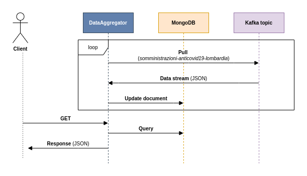

# progetto_perigea
Progetto interno SpringBoot + Kafka + Mongo + Postgre

## DataExtractor:
Ha il compito di interogare le API della regione riguardanti le somministrazioni del vaccino anticovid. Nello specifico:
- Interroga le API della regione tramite un `REST client`
- Aggiunge al JSON ottenuto campi supplementari come `sigla della provincia` e `timestamp della richiesta`
- Pubblica su un topic Kafka opportuno (somministrazioni-anticovid19-lombardia`) il JSON così costruito
- Tiene traccia su un database postgreSQL dei dati relativi alle varie esecuzioni (`UUID, timestamp, durata, esito`)
- Espone API REST per l'intrerrogazione del database in merito ai log

## DataAggregator:
Ha il compito di consumare i dati dal topic Kafka ed esporli tramite API:
- Legge periodicamente i dati dal topic Kafka
- Aggiorna una collezione MongoDB sottostante
- Espone API REST per la consultazione dei dati relativi alla vaccinazione 

